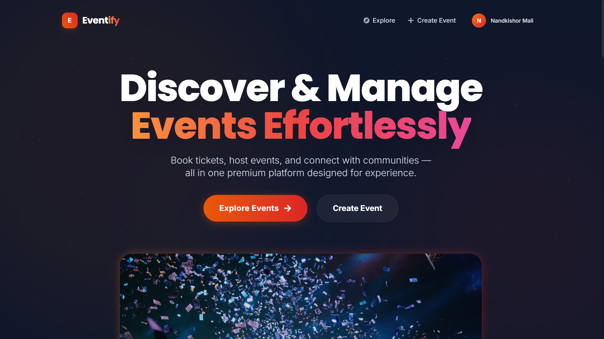

# 🎭 Eventify - Premium Event Management System



Eventify is a state-of-the-art **Online Event Management System (OEMS)** designed to provide a seamless, premium experience for both event organizers and attendees. Built with modern web technologies, it features real-time seat availability, digital QR ticketing, and a stunning, responsive UI.

## 🚀 Key Features

### for Users 🎟️
*   **Discover Events**: Browse events by categories like Music, Tech, Sports, and Arts.
*   **Real-Time Availability**: See seat counts update instantly as other users book tickets.
*   **Seamless Booking**: Book tickets in seconds with instant confirmation.
*   **Digital Tickets**: Receive a beautiful, downloadable ticket with a unique **QR Code**.
*   **User Dashboard**: View booking history and status.
*   **Responsive Design**: Works perfectly on desktop, tablet, and mobile.

### for Organizers 🎤
*   **Create & Manage**: Easily publish new events with images, details, and ticket limits.
*   **Live Analytics**: Track sales and attendance in real-time.
*   **Organizer Dashboard**: A command center to manage your events and view performance.
*   **Secure Access**: Role-based access control ensures only authorized users can manage events.

## 🛠️ Tech Stack

### Frontend (Client)
*   **React (Vite)**: For a blazing fast, interactive user interface.
*   **Tailwind CSS**: For rapid, utility-first styling.
*   **Framer Motion**: For smooth, professional animations.
*   **Socket.io Client**: For real-time bi-directional communication.
*   **Axios**: For handling HTTP requests.
*   **React Router DOM**: For seamless client-side navigation.
*   **React Hot Toast**: For beautiful notification popups.
*   **QRCode.react & HTML2Canvas**: For generating downloadable digital tickets.

### Backend (Server)
*   **Node.js & Express**: Ideally suited for scalable, non-blocking APIs.
*   **MongoDB & Mongoose**: Flexible NoSQL database schema for events and bookings.
*   **Socket.io**: Enabling real-time event updates (websockets).
*   **JWT (JSON Web Tokens)**: Secure authentication and authorization.
*   **Bcrypt**: Validated password hashing.

## 🔄 System Flow

1.  **Authentication**: Users register/login. JWT tokens are issued and stored locally.
2.  **Event Creation**: Organizers post event details. Data is stored in MongoDB.
3.  **Real-Time Updates**:
    *   When a user views an event, they connect to the Socket.io server.
    *   When a booking occurs, the server emits a `update_seats` event.
    *   All connected clients receive this event and update their UI instantly without reloading.
4.  **Booking Process**:
    *   User clicks "Book Ticket".
    *   Server validates availability and deducts seat count.
    *   Booking record created in DB.
    *   `update_seats` event broadcasted.
5.  **Ticket Generation**:
    *   On success, a modal opens with a generated QR code (Data: `BOOKING-<ID>`).
    *   User can download this as a high-quality PNG image.

## 📂 Project Structure

```bash
OEMS/
├── client/                 # React Frontend
│   ├── src/
│   │   ├── components/     # Reusable UI components (Navbar, TicketModal, etc.)
│   │   ├── layouts/        # MainLayout (Navbar + Footer wrapper)
│   │   ├── pages/          # Full page views (Home, Events, Dashboard, Login)
│   │   ├── App.jsx         # Main application entry
│   │   └── main.jsx        # DOM rendering
│   └── package.json
│
├── server/                 # Node.js Backend
│   ├── config/             # Database connection logic
│   ├── controllers/        # Request logic (auth, events, bookings)
│   ├── models/             # Mongoose Schemas (User, Event, Booking)
│   ├── routes/             # API Route definitions
│   ├── socket/             # Socket.io instance management
│   ├── server.js           # Server entry point
│   └── package.json
│
└── README.md               # You are here!
```

## 🔧 Installation & Setup

1.  **Clone the Repository**
    ```bash
    git clone https://github.com/nandkishor22/OEMS.git
    cd OEMS
    ```

2.  **Install Dependencies**
    *   **Server**:
        ```bash
        cd server
        npm install
        ```
    *   **Client**:
        ```bash
        cd client
        npm install
        ```

3.  **Environment Variables**
    Create a `.env` file in the `server` folder:
    ```env
    PORT=5000
    MONGO_URI=your_mongodb_connection_string
    JWT_SECRET=your_jwt_secret_key
    ```

4.  **Run the Application**
    *   **Server**: `npm run dev` (starts on port 5000)
    *   **Client**: `npm run dev` (starts on port 5173)

    Open [http://localhost:5173](http://localhost:5173) to view the app!

## 📜 License

This project is licensed under the [MIT License](LICENSE).

---
**Developed by Nandkishor Mali**
